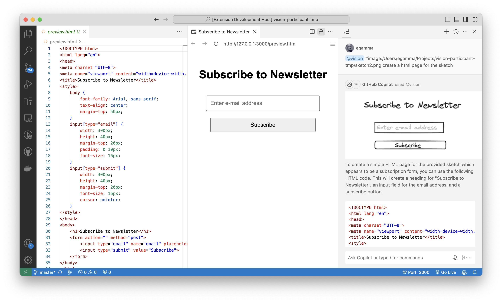

# Vison Participant

A Co-Pilot extension using the OpenAI Vision support.

## Setup

The extension requires an OpenAI API key to be set in the environment variable `OPENAI_API_KEY`.
You can also do this in a `.env` file your home directory.

The HTML preview support requires that the [Microsoft Live Preview](https://marketplace.visualstudio.com/items?itemName=ms-vscode.live-server) extension is installed.

## Usage

In the chat view you can activate the particupant using `@vision` and enter a question about an image. If there is no image reference in the prompt, the participant will ask for one.

From an open `.png` file you use the CoPilot icon to initiate a chat about the image. 

## Examples

See the folder samples for some example images and [questions](samples/Samples.md). 

