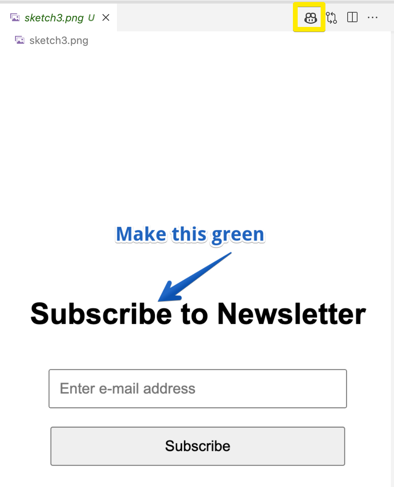

# Vison Participant

A Co-Pilot extension using the OpenAI Vision support.

## Setup

The extension requires an OpenAI API key to be set in the environment variable `OPENAI_API_KEY`.
You can also do this in a `.env` file your home directory.

## Usage

In the chat view you can activate the participant using `@vision` and enter a question about an image. If there is no image reference in the prompt (`#image`), the participant will prompt for an image using a file dialog.

You can also refer to an image using an `#file` reference in the prompt which allows you to select a file. For example:
```
@vision #file:sketch2.png what is on this image
```

From an open `.png` file you can use the CoPilot icon in the editor toolbar to initiate a chat about the image shown in the editor. 



When the response from the model includes a single html code block in the response, then the chat provides a 'Preview' button to preview the page in the simple browser.


## Examples

See the folder samples for some example images and [questions](samples/Samples.md). 


